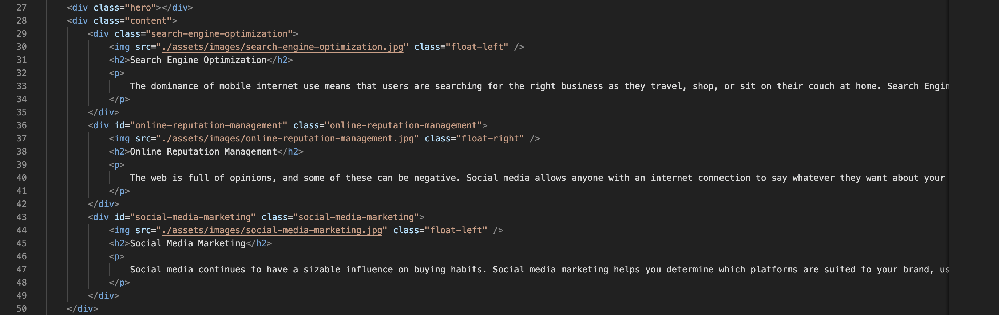
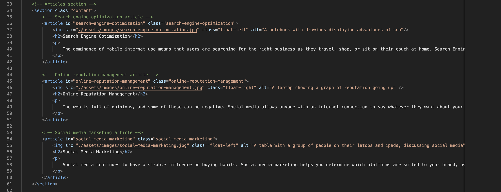

# Horiseon-Refactor
Refactoring existing codebase for optimum accessibility standards

## Table Of Content
* [General Info](#general-info)
* [Technologies](#technologies)
* [Setup](*setup)

## General Info
This is training project refactoring code to be optimized for accessibilty standards
eg. adding alt attribute to imgs. [Link to deployed application](https://bennasabir.github.io/horiseon-refactor/)

Existing Codebase

Refactored codebase

## Technologies
Project is created with 
* Html
* Css

## Setup
* No special setup requirement
